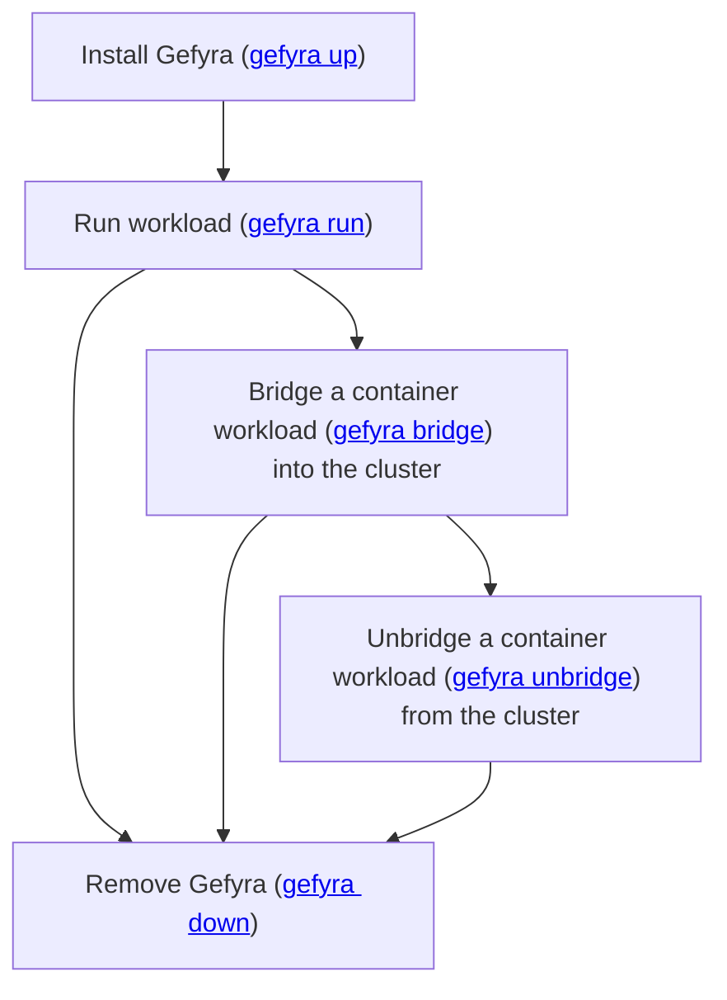

import DocCardList from '@theme/DocCardList';

# Getting Started With Local Kubernetes Cluster
This chapter contains guides on how to get started with Gefyra and different local Kubernetes solutions. These
guides are for a **single user** on a local machine.

## Workflow for single users
This workflow with Gefyra is an shortcut for local connections: `gefyra up` takes care of creating a *default* [Gefyra Client](/docs/shared-environments/clients), generating the connection configuration and setting up the connection to the cluster.

## Local Kubernetes providers

Follow along these guides to connect Gefyra with your preferred Kubernetes provider.

<DocCardList />

Hey! We would be very happy to know about your Kubernetes development setup. If you can't find your distribuition in this
list, please request a guide by creating [a GitHub issue using this template](https://github.com/gefyrahq/gefyra/issues/new?assignees=&labels=enhancement&template=guide-request.md&title=%5BGuide+request%5D%3A+).  
It's that simple and very helpful.  
