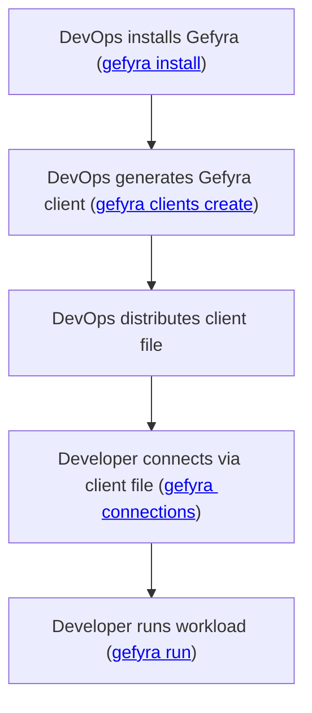

# Gefyra Clients

:::tip

Gefyra Clients provide a way to grant limited access to a Kubernetes cluster to use Gefyra's capabilities.

::: 

Gefyra v2 introduced the concept of **Gefyra Clients**. These are to better manage access to the cluster.
Creating a new client via `gefyra client create` generates a dedicated Service Account for the client. The corresponding
client file, which contains the connection parameters for the Service Account can retrieved through `gefyra client config`.
This file can be then distributed to anyone which needs to `run` or `bridge` workloads in the given cluster.
Permissions of the service account are limited, so that not everyone needs admin access to the cluster.

## Workflow for teams

## Workflow for single users
