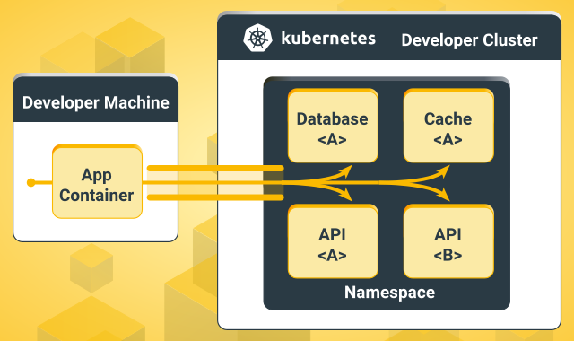
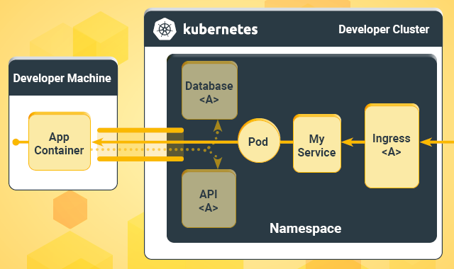

# Gefyra: Blazingly-fast, rock-solid, local application development with Kubernetes.
{: .fs-9 }

## The Problem
Building and pushing containers to test them in Kubernetes is repetitive and time-consuming. Writing and debugging code that depends on services in Kubernetes is daunting. Especially if they are not reachable during development.
{: .fs-6 .fw-300 }

## The Solution
Gefyra runs local code in any Kubernetes cluster without the build and push cycle. It overlays containers in the cluster making code changes immediately available.
{: .fs-6 .fw-300 }

[Try it now](/getting-started/){: .btn .btn-primary .fs-5 .mb-4 .mb-md-0 .mr-2 } [View it on GitHub](https://github.com/gefyrahq/gefyra){: .btn .fs-5 .mb-4 .mb-md-0 }

## Core Features
### Run a container instance on a developer machine and connect it to Kubernetes-based resources
You can run an arbitrary container on your local development machine that behaves as it would run within a Kubernetes cluster. It connects to Kubernetes-based resources (such as databases, APIs, or assets), making it very
convenient to test a new service in the cluster or write code that depends on Kubernetes resources.

<div align="center">
 
</div>

### Overlay a container running within a Kubernetes Pod with a local instance 
You can simply replace a container running in a Kubernetes Pod with a local container instance. That will 
serve the requests to that Pod from your local container instances. That makes it very convenient to test changes in a realistic production-close
environment before pushing the code to CI/CD.

<div align="center">
 
</div>

### Gefyra offers you to
- run services locally on a developer machine
- operate feature-branches in a production-like Kubernetes environment with all adjacent services
- write code in the IDE you already love, be fast, be confident
- leverage all the neat development features, such as debugger, code-hot-reloading, overriding environment variables
- run high-level integration tests against all dependent services
- keep peace-of-mind when pushing new code to the integration environment 

## Quick installation

```bash
curl -sSL https://raw.githubusercontent.com/gefyrahq/gefyra/main/install.sh | sh -
```

Looking for Homebrew or Windows installation? Checkout the [installation guide](/installation).

## Use Cases and Demos
If you are interested in more sophisticated use cases or want to develop modern Kubernetes-based architectures, 
check out the [use cases and demos](/usecases/) or [the media section](/media/). 

## Alternative to Telepresence 2
Compared to [Telepresence 2](https://www.telepresence.io/docs/latest/reference/architecture/), Gefyra uses a Wireguard-based
VPN to connect with the Kubernetes cluster. Telepresence 2 provides a broad connectivity with the cluster ("your development
machine becomes part of the cluster"), Gefyra instead establishes a very scoped connectivity based on a dedicated Docker-network on the
developer machine. In addition, Gefyra supports a couple of important use-cases such as the sidecar pattern 
(see: [this medium article](https://medium.com/bb-tutorials-and-thoughts/kubernetes-learn-sidecar-container-pattern-6d8c21f873d)) and does not require
"sudo"-privileges during the development process.  
Anyway, if you feel you need other features that Telepresence 2 provides and Gefyra misses, please give it a go. Gefyra was heavily 
inspired by Telepresence 2.

Gefyra was designed to be fast and robust on an average developer machine and supports most platforms.


